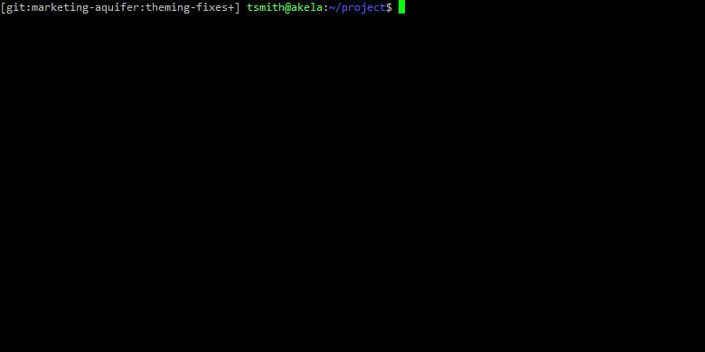

# Cleaner History with Interactive Commit Building in Git

My home is a cluttered place. So my quest for tidiness takes other, more
obscure forms: maintenance of a _pristine_ Git repository history that explains
why and how the project took shape as it did.

Sometimes when building a feature, making theming adjustments, or trying to meet
a deadline, it's easy to get in the weeds and write a ton of code. This happens
to me a lot when I'm running through a client's change order, tweaking the frontend
as new features take shape, or building new functionality in Drupal 7
using Features. Committing it all at once is quick, but leaves other developers
(and sometimes myself...) unable to follow my train of thought. Being able to
tell a story with code comments and history is key to maintainability.

**Git's Interactive mode for selecting files and diff hunks to the staging area
makes it easy to break down a dirty working tree into small, well-documented
commits.**

_Wait, is this the same thing as patch mode?_ If you're using patch mode, you're
already my kinda crazy. Patch mode is a component of interactive mode, and I'll
explain both.

**Patch Mode:** `git add -p` asks if you want to add, skip, or edit each
individual hunk (a piece in a diff), in order:



After selecting or rejecting individual hunks, I've built this staging area,
which would only commit the differences I had selected:


Patch adding is great if:

- You don't have too many modified files
- Everything is modified (patching doesn't pick up untracked files)
- All the differences are worth reading: I believe in running a `git diff`
  before committing to double-check, but Features module exports, SVGs, compiled
  CSS or JS assets, or updated core/contrib files usually aren't worth reading.

You should try interactive adding if you find yourself wishing you could patch
in some changes, but easily stage other entire files or untracked files, like:

- Pick the Sass changes, but just add all Field Instance or Panels exported settings
- Pick up untracked Sass partials and patch in the line that includes them

**Interactive Mode:** `git add -i` lists the status of your work tree by file:
new files or directories, changed files, and deleted files and asks how you want
to handle it all. You can which files to add or patch so you don't have to patch
through something like Features output or preprocessed/minified CSS/JS output\*
which is a pain to read. _(\* Don't include that in your repo if you can avoid it.)_

Here's a mess:

```
[git:txe:home-page-settings+?] taylor@webchef2:~/www/txe/sites/all/modules/features$ git status
# On branch home-page-settings
# Changes not staged for commit:
#   (use "git add <file>..." to update what will be committed)
#   (use "git checkout -- <file>..." to discard changes in working directory)
#
#       modified:   ../custom/txex/txex.install
#       modified:   txex_benefit_content/txex_benefit_content.module.inc
#       modified:   txex_home_page/txex_home_page.module
#       modified:   txex_home_page/txex_home_page.pages_default.inc
#
# Untracked files:
#   (use "git add <file>..." to include in what will be committed)
#
#       txex_home_page/plugins/
#       txex_home_page/txex_home_page.module.inc
no changes added to commit (use "git add" and/or "git commit -a")
[git:txe:home-page-settings+?] taylor@webchef2:~/www/txe/sites/all/modules/features$
```

In short, I've got new files, changes in Features code on two features modules,
changes to module code... All because I banged out something I'm proud of in one
uninterrupted hour.

Kicking off git's interactive staging mode shows me the tree again and offers
some options:

```
[git:txe:home-page-settings+?] taylor@webchef2:~/www/txe/sites/all/modules/features$ git add -i
           staged     unstaged path
  1:    unchanged        +7/-0 sites/all/modules/custom/txex/txex.install
  2:    unchanged        +1/-0 sites/all/modules/features/txex_benefit_content/txex_benefit_content.module.inc
  3:    unchanged        +1/-0 sites/all/modules/features/txex_home_page/txex_home_page.module
  4:    unchanged       +9/-16 sites/all/modules/features/txex_home_page/txex_home_page.pages_default.inc

*** Commands ***
  1: status       2: update       3: revert       4: add untracked
  5: patch        6: diff         7: quit         8: help
What now>
```

Press [WHAT] to pick files to _patch,_ then hit enter twice to patch just those:

[SCREENCAP OF FILES TO PATCH, THEN PATCH THEM]

Press [WHAT] to pick files to _add,_ (stage completely) then hit enter twice to
add them:

[SCREENCAP OF FILES TO ADD, THEN ADD THEM]

Build narrowly focused commits this way, commit them, then repeat until you've
committed your whole working tree. Now you've built a sensible story with your
code history that will help your teammates/future maintainers understand
your process or merge your code easily.
