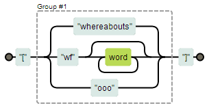

# Email is killing me

We here at [Four Kitchens](http://www.fourkitchens.com) do love us some email.
Last week, I self-awarded a prize for having achieved 4,000 unread items in my
inbox, with another 3,000 read items sitting in my inbox for no reason. I could
keep going for the record, but I thought I'd attempt to use nerdiness to take
better control.

(Ultimately, it's a chore that simply has to be done, but maybe it can be easier.)

## Filters feel limited

I came to Gmail from Exchange; Filters have always seemed less powerful than Rules.

My gripes with Gmail Filters:

- Search is limited, seemingly, to word and number characters; special characters
  have no effect in searches, so I can't isolate "**\[** category **\]**" strings we
  use in subject lines.
- Complex groups of boolean logic have a tendency to produce imprecise results
  and there's no way to have "additional criteria" (even if multiple fields are
  used in the advanced search/filter builder, they're flatted into a single query)
- Other header information or metadata can't be used in the search criteria
  (like mailed-by to help weed out notifications "from" a user sent on their
  behalf by another service)
- Filters cannot be run on sent mail (for the purposes of auto-labeling)
- Filters cannot be run on a delay
- No regular expression matching

## Ta-Daa! [Gmail can be scripted](https://developers.google.com/apps-script/reference/gmail/) with JavaScript!

{{ Insert awesomesauce. }}

### Step 1: Migrate Filters to JavaScript for More Power

**Goal:** Label _everything_, both incoming and outgoing. Additionally, some theads
are starred, marked as `/(un)?(important|read)/`, or immediately auto-archived.

``` js
function autoTagMessages(thread, index, threads) {
  var msg     = thread.getMessages()[0],
      subject = thread.getFirstMessageSubject(),
      to      = [msg.getTo(), msg.getCc()].join(', '),
      from    = msg.getFrom(),
      any     = [to, from].join(', ');
```

A new function is created for tagging messages. We compile a list of useful
variables and then move straight to categorizing:

_Timely Messages_ generally require direct action, quickly. They are added to
the label '~/Announcements' by
[`thread.addLabel()`](https://developers.google.com/apps-script/reference/gmail/gmail-thread#addLabel(GmailLabel))
and also starred using
[`message.star()`](https://developers.google.com/apps-script/reference/gmail/gmail-message#star()).

_Gotchas:_
- The `addLabel()` function requires a Label object, not a string. Such
  an object can be obtaind using [`GmailApp.getUserLabelByName()`](https://developers.google.com/apps-script/reference/gmail/gmail-app#getUserLabelByName(String)).
- Be sure to include 'parent/child' if your labels are hierarchical. (In this case,
  'Announcements' is a child of '~').
- When using `string.match()`, be sure to add the `i` flag at the end of the
  pattern to ignore case, since authors may be inconsistent with case.


``` js
  // Immediate To-Do Items
  if (subject.match(/\[timely\]/i) !== null) {
    msg.star();
    thread.addLabel( GmailApp.getUserLabelByName("~/Announcements") );
  }
```

_Whereabouts_ emails are generally uninteresting since I work remotely most of
the time. They're all flagged as '~/Whereabouts' and, if they don't appear to
indicate that the sender will be unavailable, they are archived immediately:

``` js
  // Whereabouts Info (except stuff I don't care about)
  if (subject.match(/\[(whereabouts|wf\w*|ooo)\]/i) !== null) {
    thread.addLabel( GmailApp.getUserLabelByName("~/Whereabouts") );

    // Most of this is just "I'm working at home today", but this may be
    // a poorly-imagined idea... We'll see...
    if (subject.match(/(ooo|offline|unavailable|errands)/i) === null) {
      thread.moveToArchive();
    }
  }
```

_Regex on line 2 <a href="http://www.regexper.com/#%2F%5C%5B(whereabouts%7Cwf%5Cw*%7Cooo)%5C%5D%2Fi">visualized</a>:_



### Step 2: Script Email Expirations

My second function will run hourly to automatically archive threads that have
dated out. Since the `autoTagMessages()` function has everything categorized, we
will base retention and expiration off of labels, thread ages, and whether or not
the thread is read.

{{ Walkthrough of autoArchive() }}

### Step 3: Setup Triggers (like Cron for your inbox)

{{ Trigger instruction }}

## Declare a Reset, then Profit

Be sure to warn folks when you're about to purge a few thousand threads from your
inbox. Then sit back, _keep up with what you can_ using the auto-labeling help
you've built, and let Google Apps Scripts help you.
